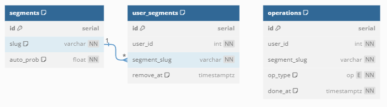

# User segments management service in Go


## Описание 

Микросервис по обработке сегментов пользователей, позволяющий:
* Добавлять, удалять сегменты

* При добавлении сегмента указывать вероятность автоматического попадания пользователей в него

* Добавлять/удалять пользователя из заданных сегментов

* При добавлении пользователя в сегмент задать время автоматического удаления пользователя из сегмента

* Получать историю операций пользователя за определённый период в виде csv-файла

Использовались следующие технологии:
|                            |                |
| -------------------------- | -------------- |
| Веб-фреймворк              | __gin__        |
| База данных                | __PostgreSQL__ |
| Драйвер базы данных        | __pgx__        |
| Генерация интерфейсов к БД | __sqlc__       |
| Развёртывание среды        | __Docker__     |
| Логгер                     | __zerolog__    |

Структура сервиса придерживается Clean Architecture для гибкости и расширяемости проекта.

## Запуск сервиса
Для запуска сервиса нужно положить в корневую директорию файл .env ([пример](/docs/example.env)) и ввести команду 

```bash
$ make compose-up
```

## Документация 

[Cхема базы данных](docs/schema.sql):


[Описание методов API в Postman](https://documenter.getpostman.com/view/20022244/2s9Y5crzEk)
